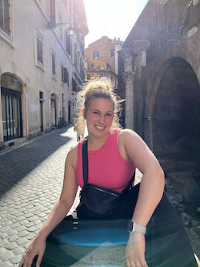

## Hi there my name is Morgan 👋

# Who is Morgan? # 

This is me 

 

I am in my *fourth year* of my neuroscience major at Dal 

# Why NESC 3505? # 

I've always liked learning about interpreting data in different ways and I've always been interested in learning more about python coding so when I found this course and it fit into my schedule it was **perfect**! 

# Why neuroscience? #

Coming out of highschool I was still a bit unsure of what I wanted to study but I enjoyed learning about how the brain worked so I thought that neuroscience would be a good start and would open lots of doors that I could look into further down the road. 

# What's the post-grad plan? # 

I'm still pretty unsure of what path to take after my bachelors but I'm currently looking into occupational therapy. There will definitely be some traveling in my future, even if it isn't immediately after graduation! 

<!--
**mmossman04/mmossman04** is a ✨ _special_ ✨ repository because its `README.md` (this file) appears on your GitHub profile.

Here are some ideas to get you started:

- 🔭 I’m currently working on ...
- 🌱 I’m currently learning ...
- 👯 I’m looking to collaborate on ...
- 🤔 I’m looking for help with ...
- 💬 Ask me about ...
- 📫 How to reach me: ...
- 😄 Pronouns: ...
- ⚡ Fun fact: ...
-->

[def]: /workspaces/mmossman04/IMG_1702.png